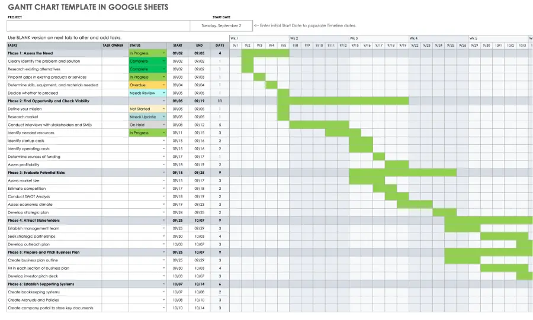
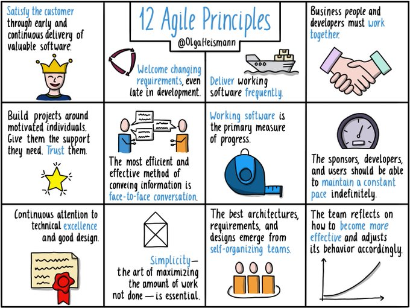

--- 
title:     | 
    | Data Science Project Management
    | Adapting PM methodologies
author: "Kian Chapman-Raafat"
date: "`r Sys.Date()`"
site: bookdown::bookdown_site
documentclass: book
bibliography: [book.bib, packages.bib]
url: https://rosenkavalier.github.io/datascience-pm/
description: |
  A short introduction to project planning methods in data science.
link-citations: yes
github-repo: rstudio/bookdown-demo
---

# Data science and project management basics
Data science is at a funny age. Even five years ago a data science ‘team’ was often only one or two people working on a pet project. Today, mercifully, lots of us work in much larger teams filled with brilliant people. Some work in an ‘orchestra-style’ setup in multi-disciplinary teams where expert product/project/delivery managers collaborate substantively. There are still, however, many others who work in a in between place - where the more experienced data scientists in the team may take on project management (PM), as well as writing code.

There is relatively limited material and courses out there for new data science project leads (who are working without embedded project managers) that recommend how to pick up relevant PM skills, or how to adapt existing PM methodologies to fit the unique needs of a product data science team. When I was in this position after a promotion I attended Agile workshops geared at software developers and found that they didn’t quite fit my needs. Over time I have made adaptations to my planning process when running a data science project, which I have brought together here. 
 
## PM schools of thought {#schools}

You don't need to get certified as a project manager (unless you want to) but it’s worth taking some learning time to understand a little about the different project management frameworks out there as there are elements you can borrow from most of them - [Waterfall](https://blog.mindmanager.com/waterfall-methodology/), [Agile](https://www.atlassian.com/agile) (in its various forms including [Scrum](https://www.atlassian.com/agile/scrum) and [Kanban](https://www.atlassian.com/agile/kanban),[Extreme Programming XPM](https://crm.org/news/extreme-project-management)) and [Lean](https://www.easyagile.com/blog/lean-agile/) (technically not Agile but very similar).

## Waterfall

Traditional waterfall methodologies put the planning work upfront - planning each stage of work needed to reach a final objective with timelines for each milestone and stage. Work on each stage is linear (no do-agains) and will probably include the production of a huge Gantt chart^[Image is sourced from: https://www.smartsheet.com/content/make-gantt-chart-google-sheets] showing the route forward. 

This may work well for many fields like construction, where after you build a wall you probably don’t want to iterate on it by knocking it down and rebuilding it better this time round, but in data science, we need flexibility for iteration to refine our work. Waterfall planning requires knowing from the start exactly where you want to go and the best way to get there. I have rarely had the privilege of knowing either of these things at the start of a data science project, and I would argue some of the personal strengths of our field are experimentation, failing fast, and navigating very open questions so it would make sense that we need planning frameworks that honour this.      

### Short analytical plan with waterfall

In the wild circumstance where you do happen to know both where you want to go and the best way to get there (lucky you), a quick alternative for a short project is to write a one or two-sided A4 ‘analytical plan’ with bullets asking the big questions and listing the things to get done, their main sub-tasks, and the ordering they need to be done in with key dates/timing estimations. If you are collaborating with others, each bullet/sub-bullet can be a Jira card or you can just work in a shared document and tick them off as you go. Feel free to use my [template](https://docs.google.com/document/d/1XJxFgBigIwUuNMz1kpmWJhtMOFpk7AXcI9L6jzCw1-8/edit?usp=sharing).  

## Agile
Agile has a very different set of priorities from waterfall. It was originally developed as a software development PM tool and emphasizes using flexibility and customer collaboration to get the best result. There are several different flavours or frameworks of Agile, and each takes a slightly different approach on how to deal with the ‘12 Agile principles’^[Image is sourced from Olga Heismann: https://twitter.com/OlgaHeismann/status/1364857111201656835]. I will go into each method in very brief detail later \@ref(flavours), or if you want to go deeper use the links in \@ref(schools).  

Below I will cover some of the key points I think are important to know about Agile, but I recommend taking a much deeper look if it is new to you or you are particularly interested. This write up by [Toptotal](https://www.toptal.com/project-managers/agile/ultimate-introduction-to-agile-project-management) is a good place to start.  

**If you are already familiar with Agile then you can skip this section.**

### Who

Agile teams are typically **multi-disciplinary** built around skill sets and different roles. This might mean having team members such as a product owner, delivery lead, project manager, data engineer, and data scientist who each contribute in very defined and separate ways.  

### Meeting structures (ceremonies)
Agile flavours handle this slightly differently, but typically in Agile there is a structured list of different meetings (known as ceremonies) that have different frequencies, attendees and purposes, all of which influence the work in their own way. Some of the common ones are:   

1. **Stand up**: a short (usually daily) meeting for all team members to share their progress and blockers, and what they plan to do next.  
2. **Show and Tell**: regular meetings (often weekly) with stakeholders/product owners to show them where your work has reached so far. This is a great chance to find anything that needs to be changed before you go too far down the wrong path and keep your key stakeholders fully involved.  
3. **Retrospectives**: semi-frequent meetings (at least fortnightly) to reflect as a group by speaking kindly but candidly about what has been going well or poorly. From this, we can find what changes the team wants to take on for the next period of work to address these concerns. 

### Record keeping and documentation
In the spirit of accountability, Agile teams need somewhere to share progress and record it. If you have a project manager they may keep a board with details of what work is being done/needs to be done next and by who. If you don't have a project manager you will need to keep it up to date yourself. Boards can be used to understand what other members of the team are up to and track work. There are a myriad ways to organise your board, but in terms of platforms to build a board, Jira is the most common but there are other simpler options such as Trello or Microsoft Planner.

### Understanding the problem
Agile seeks to understand what your customer needs through the lens of **User Stories**. These are a collection of short statements declaring what your customer wants to be able to do with your work and why, and give us a definition of 'done'. An an example of this could be "As a customer specialist I want to be able to make it easy for customers to find relevant content, which increases their satisfaction and retention". User statements can be from multiple stakeholders or angles but should provide the basis of why are are trying to do anything at all. They are normally collected through interviews and user research and can be collected together into groups or 'Epics' or broken down into smaller 'Tasks'.

### Iteration
Another key concept is iteration and delivering a working 'something' quickly. This means splitting your user stories and features into things you want to work on now, vs things you want to add later. If the project gets cut, completing one user story and being able to deliver it to a customer is better than doing half of two which are unusable. Working this way also gives you checkpoints to see if your work is worth it to users before investing half a year, or perhaps show you that what you have built is already enough and adding the extras doesn't add much value.

### Differences in Agile flavours {#flavours}

The key differences between the different Agile varieties/methodologies are:  

1. **Kanban** work is focused around planning work on a board.  
2. **Scrum** uses a board similar to Kanban, but breaks works short time periods known as sprints (1-4 weeks). Work is assigned to fit into what can be done in that time period.  
3. **Extreme programming** takes Scrum and adds processes that are particularly relevant for programming, such as refactoring.  
4. **Lean** is a neighbour to Agile and is focused on delivering good work fast.  